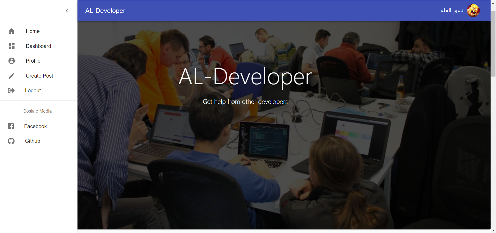

## MERN al-developer-back-front





> A quick walkthrough of my al-developer app built using React, React Router, Redux ,Express and mongoDB, the project current


## See it live

[MERN al-developer-back-front live on heroku](https://al-developer.herokuapp.com/)

## Quick Start

```bash
# Install dependencies for server
npm install

# Install dependencies for client
npm run client-install

# Run the client & server with concurrently
npm run dev

# Run the Express server only
npm run server

# Run the React client only
npm run client

# Server runs on http://localhost:5000 and client on http://localhost:3000
```


## App Info

### Author

Ghassan Aldarwish
[al-developer](https://al-developer.herokuapp.com/)

### Version

1.0.0

### License

This project is licensed under the MIT License
